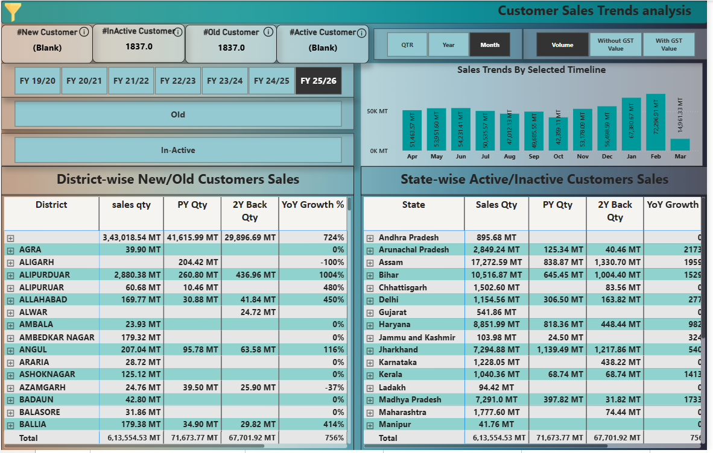

# Customer-Segmentation-Sales-Trends-Analysis-Dashboard

📌 Project Overview

This project is an interactive Power BI dashboard designed to analyze customer behavior and sales performance across multiple financial years. The dashboard helps businesses identify customer segments, track sales trends, measure growth, and evaluate regional performance.

The solution provides actionable insights into customer retention, customer inactivity, sales growth, and geographic sales distribution.

🎯 Business Problem

Organizations often struggle to answer questions such as:

How many new customers were acquired this year?
Which customers have become inactive?
Which regions are driving sales growth?
How does current sales performance compare with previous years?
Which districts and states contribute the highest sales volume?

This dashboard addresses these challenges by providing a centralized and interactive reporting solution.

Objectives
Segment customers into meaningful categories.
Monitor customer activity and retention.
Analyze sales trends across financial years.
Compare current performance with historical data.
Identify high-performing and low-performing regions.
Measure Year-over-Year (YoY) growth.

🛠️ Tools & Technologies Used
Tool       |	      Purpose
-----               -------
Power BI Desktop  	Dashboard Development
Power Query	        Data Transformation
DAX	                KPI Calculations
SQL	                Data Extraction & Preparation
MySQL DB	          Source Data

📂 Dashboards
- Customer wise sales trends
- Dealer wise sales trends
- Sales Contribution by HOD
- Top Contributor Analysis
- YoY Coparative Analysis
- MoM on Comparative Analysis

📈 Key KPIs
Customer KPIs
Total Active Customers
Total Inactive Customers
Total New Customers
Total Old Customers

Sales KPIs: 
Total Sales Quantity (MT)
Previous Year Sales
2 Years Back Sales
YoY Growth %

📊 Dashboard Screenshot

